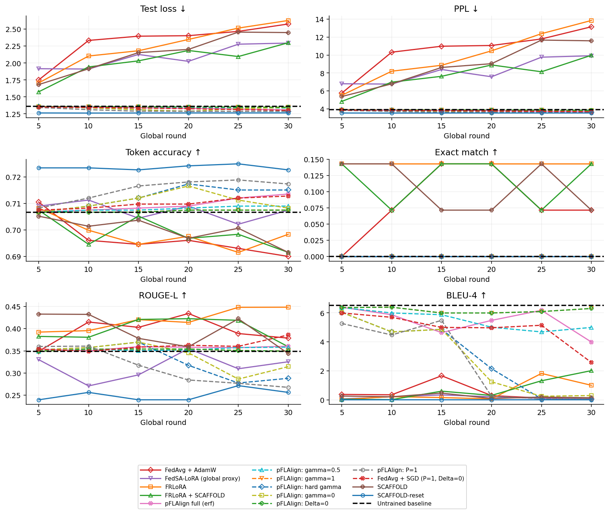
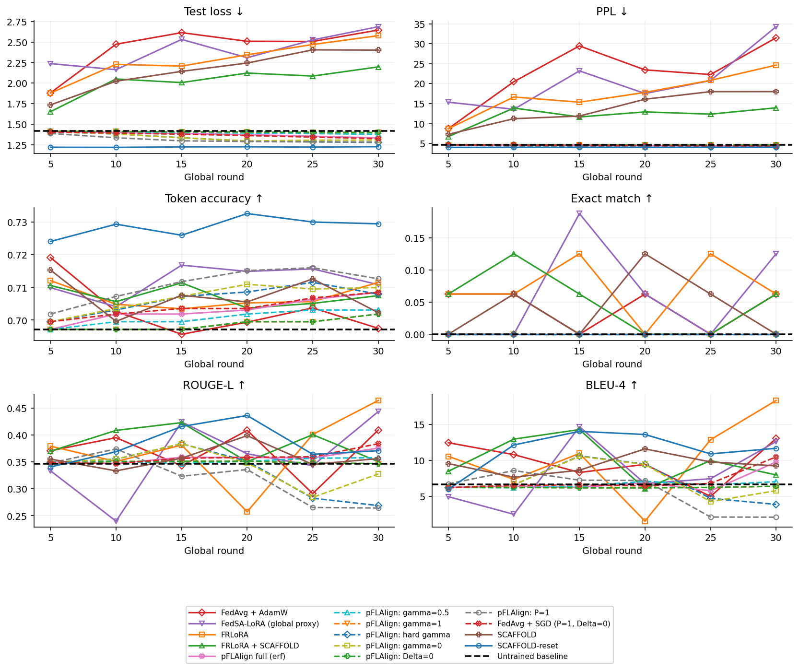
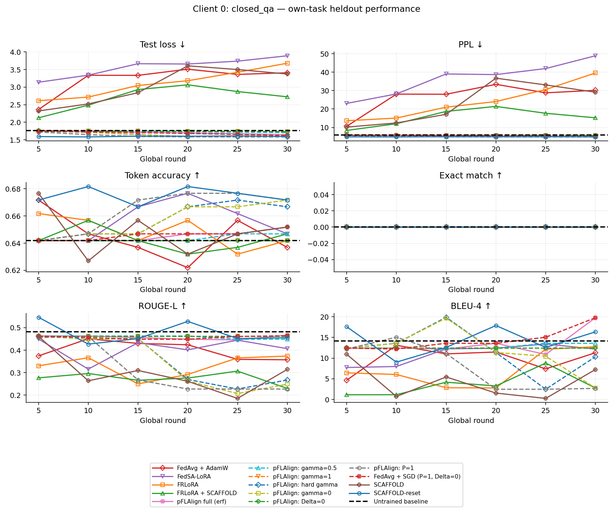
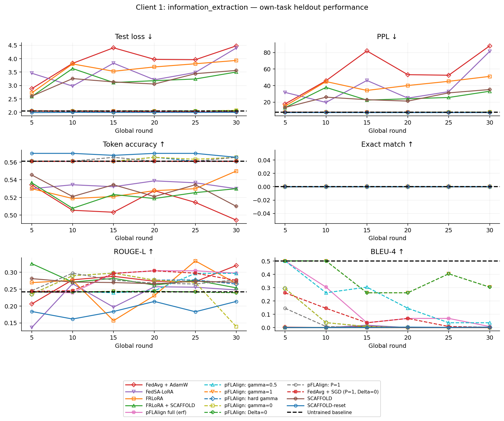
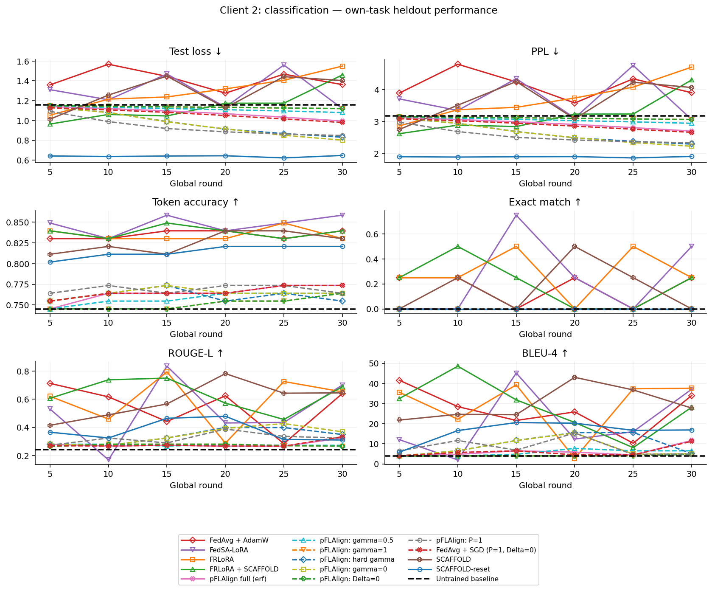
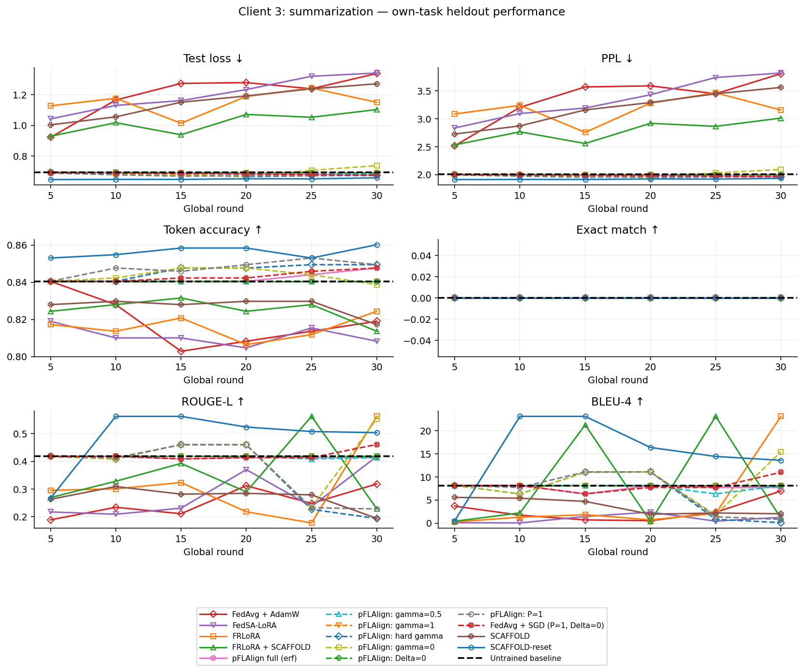
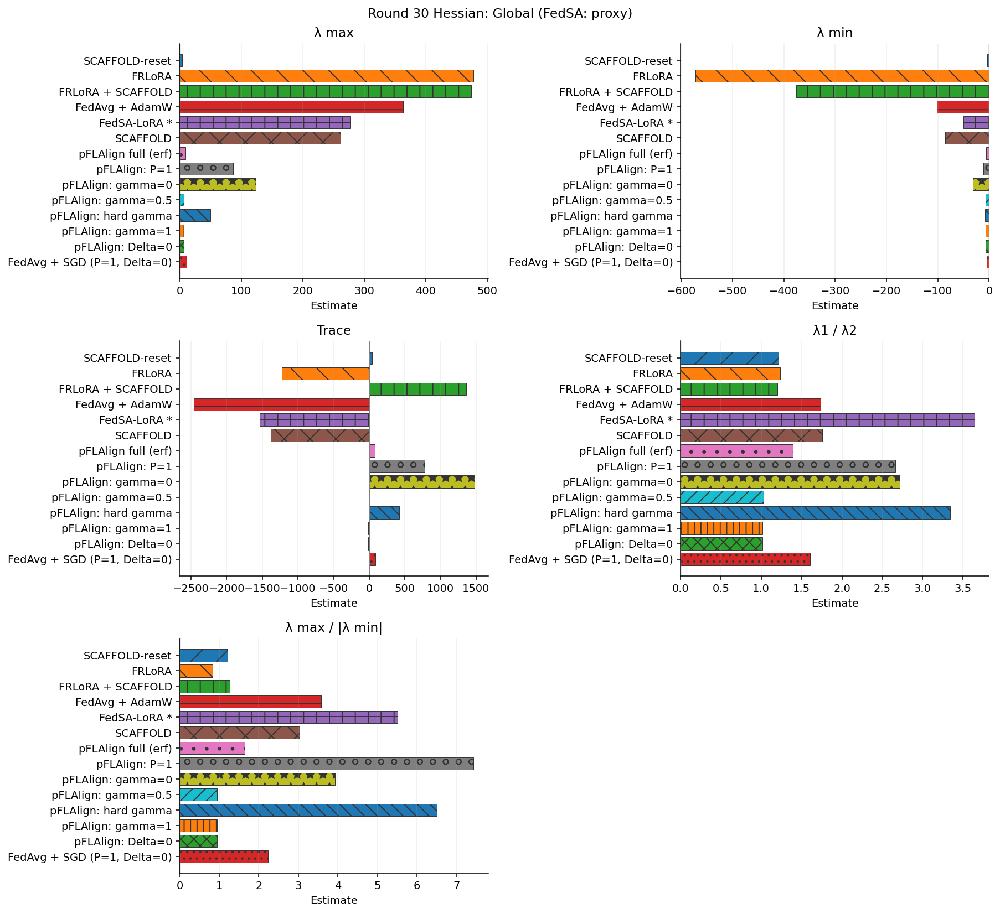

# 연합학습 통합 비교

각 클라이언트의 로컬 학습 직후 모델을 자기 태스크 test에서 평가했습니다. 학습 전 baseline은 0라운드, 학습 방법은 30라운드 결과입니다.

Loss·PPL은 낮을수록 좋고, 나머지는 높을수록 좋습니다. Token accuracy·Exact match·ROUGE-L은 0–1, BLEU는 0–100입니다.

TinyLlama 1.1B · 30 rounds × 5 local epochs · constant LR 2e-4 · 생성 최대 500토큰. Test는 학습과 분리된 총 14개이며 단일 seed 결과입니다.

[Hessian 비교표·그림](hessian_comparison.md) · [전체 로컬 평균 곡선](local_performance.png)

## 실행 상태 (보고서 갱신 시점)

아래 성능표에는 완료된 조건만 포함됩니다. 이 파일은 완료된 실험의 고정된 공개 스냅샷입니다.

| 방법 | 상태 | 마지막 기록 round | 글로벌 평가 round |
|---|---|---:|---:|
| Untrained baseline | 완료 | 0 | 0 |
| SCAFFOLD-reset | 완료 | 30 | 30 |
| FRLoRA | 완료 | 30 | 30 |
| FRLoRA + SCAFFOLD | 완료 | 30 | 30 |
| FedAvg + AdamW | 완료 | 30 | 30 |
| FedSA-LoRA (global proxy) | 완료 | 30 | 30 |
| SCAFFOLD | 완료 | 30 | 30 |
| pFLAlign full (erf) | 완료 | 30 | 30 |
| pFLAlign: P=1 | 완료 | 30 | 30 |
| pFLAlign: gamma=0 | 완료 | 30 | 30 |
| pFLAlign: gamma=0.5 | 완료 | 30 | 30 |
| pFLAlign: hard gamma | 완료 | 30 | 30 |
| pFLAlign: gamma=1 | 완료 | 30 | 30 |
| pFLAlign: Delta=0 | 완료 | 30 | 30 |
| FedAvg + SGD (P=1, Delta=0) | 완료 | 30 | 30 |

## 글로벌 전체 test

| 방법 | Test loss ↓ | PPL ↓ | Token accuracy ↑ | Exact match ↑ | ROUGE-L ↑ | BLEU-4 ↑ |
|---|---:|---:|---:|---:|---:|---:|
| Untrained baseline | 1.3596 | 3.8945 | 0.7067 | 0.0000 | 0.3485 | 6.5125 |
| SCAFFOLD-reset | 1.2642 | 3.5402 | 0.7226 | 0.0000 | 0.2564 | 0.0083 |
| FRLoRA | 2.6289 | 13.8590 | 0.6983 | 0.1429 | 0.4482 | 1.0081 |
| FRLoRA + SCAFFOLD | 2.3003 | 9.9775 | 0.6915 | 0.1429 | 0.3592 | 2.0196 |
| FedAvg + AdamW | 2.5768 | 13.1556 | 0.6900 | 0.0714 | 0.3786 | 0.0835 |
| FedSA-LoRA (global proxy) | 2.2950 | 9.9241 | 0.7074 | 0.0000 | 0.3254 | 0.0588 |
| SCAFFOLD | 2.4502 | 11.5902 | 0.6915 | 0.0714 | 0.3438 | 0.1483 |
| pFLAlign full (erf) | 1.3082 | 3.6995 | 0.7135 | 0.0000 | 0.3605 | 3.9923 |
| pFLAlign: P=1 | 1.2903 | 3.6339 | 0.7173 | 0.0000 | 0.2678 | 0.0777 |
| pFLAlign: gamma=0 | 1.3446 | 3.8365 | 0.7082 | 0.0000 | 0.3144 | 0.3007 |
| pFLAlign: gamma=0.5 | 1.3351 | 3.8004 | 0.7090 | 0.0000 | 0.3582 | 5.0000 |
| pFLAlign: hard gamma | 1.2870 | 3.6220 | 0.7150 | 0.0000 | 0.2881 | 0.0435 |
| pFLAlign: gamma=1 | 1.3480 | 3.8499 | 0.7074 | 0.0000 | 0.3494 | 6.3062 |
| pFLAlign: Delta=0 | 1.3481 | 3.8500 | 0.7074 | 0.0000 | 0.3494 | 6.3062 |
| FedAvg + SGD (P=1, Delta=0) | 1.3022 | 3.6773 | 0.7128 | 0.0000 | 0.3858 | 2.5811 |

## 로컬 Macro 평균

| 방법 | Test loss ↓ | PPL ↓ | Token accuracy ↑ | Exact match ↑ | ROUGE-L ↑ | BLEU-4 ↑ |
|---|---:|---:|---:|---:|---:|---:|
| Untrained baseline | 1.4159 | 4.6941 | 0.6971 | 0.0000 | 0.3461 | 6.6691 |
| SCAFFOLD-reset | 1.2247 | 4.0348 | 0.7295 | 0.0000 | 0.3707 | 11.6941 |
| FRLoRA | 2.5777 | 24.6361 | 0.7116 | 0.0625 | 0.4640 | 18.3551 |
| FRLoRA + SCAFFOLD | 2.1968 | 13.9258 | 0.7075 | 0.0625 | 0.3505 | 7.9920 |
| FedAvg + AdamW | 2.6462 | 31.4941 | 0.6975 | 0.0625 | 0.4091 | 13.0588 |
| FedSA-LoRA (global proxy) | 2.6872 | 34.2782 | 0.7109 | 0.1250 | 0.4433 | 12.6308 |
| SCAFFOLD | 2.4016 | 17.9923 | 0.7023 | 0.0000 | 0.3561 | 9.2505 |
| pFLAlign full (erf) | 1.3317 | 4.3308 | 0.7085 | 0.0000 | 0.3754 | 9.7815 |
| pFLAlign: P=1 | 1.2817 | 4.1720 | 0.7127 | 0.0000 | 0.2644 | 2.1104 |
| pFLAlign: gamma=0 | 1.3055 | 4.3160 | 0.7100 | 0.0000 | 0.3275 | 5.7988 |
| pFLAlign: gamma=0.5 | 1.3759 | 4.5155 | 0.7031 | 0.0000 | 0.3578 | 7.0524 |
| pFLAlign: hard gamma | 1.2760 | 4.1553 | 0.7080 | 0.0000 | 0.2689 | 3.8890 |
| pFLAlign: gamma=1 | 1.3969 | 4.6090 | 0.7019 | 0.0000 | 0.3468 | 6.4083 |
| pFLAlign: Delta=0 | 1.3970 | 4.6093 | 0.7019 | 0.0000 | 0.3468 | 6.4083 |
| FedAvg + SGD (P=1, Delta=0) | 1.3225 | 4.2915 | 0.7085 | 0.0000 | 0.3837 | 10.5000 |

로컬 평균은 클라이언트별 지표의 산술평균입니다. 글로벌 PPL은 전체 정답 토큰 NLL로 계산합니다. FedSA의 글로벌 모델은 공유 A와 가중 평균 B로 만든 비교용 proxy입니다.

## Client 0 — closed_qa

Test 4개.

| 방법 | Test loss ↓ | PPL ↓ | Token accuracy ↑ | Exact match ↑ | ROUGE-L ↑ | BLEU-4 ↑ |
|---|---:|---:|---:|---:|---:|---:|
| Untrained baseline | 1.7613 | 5.8199 | 0.6418 | 0.0000 | 0.4816 | 14.1788 |
| SCAFFOLD-reset | 1.5962 | 4.9345 | 0.6716 | 0.0000 | 0.4550 | 16.3455 |
| FRLoRA | 3.6779 | 39.5638 | 0.6418 | 0.0000 | 0.3739 | 12.7450 |
| FRLoRA + SCAFFOLD | 2.7237 | 15.2371 | 0.6468 | 0.0000 | 0.2301 | 2.7649 |
| FedAvg + AdamW | 3.4069 | 30.1719 | 0.6368 | 0.0000 | 0.3573 | 11.3009 |
| FedSA-LoRA | 3.8898 | 48.9026 | 0.6468 | 0.0000 | 0.4066 | 12.1771 |
| SCAFFOLD | 3.3720 | 29.1366 | 0.6517 | 0.0000 | 0.3145 | 7.2374 |
| pFLAlign full (erf) | 1.6429 | 5.1703 | 0.6517 | 0.0000 | 0.4663 | 19.7678 |
| pFLAlign: P=1 | 1.5857 | 4.8829 | 0.6716 | 0.0000 | 0.2272 | 2.6658 |
| pFLAlign: gamma=0 | 1.6109 | 5.0075 | 0.6716 | 0.0000 | 0.2491 | 2.7642 |
| pFLAlign: gamma=0.5 | 1.7037 | 5.4941 | 0.6468 | 0.0000 | 0.4485 | 13.5841 |
| pFLAlign: hard gamma | 1.5858 | 4.8834 | 0.6667 | 0.0000 | 0.2674 | 10.3295 |
| pFLAlign: gamma=1 | 1.7346 | 5.6666 | 0.6418 | 0.0000 | 0.4628 | 12.4180 |
| pFLAlign: Delta=0 | 1.7347 | 5.6672 | 0.6418 | 0.0000 | 0.4628 | 12.4180 |
| FedAvg + SGD (P=1, Delta=0) | 1.6275 | 5.0911 | 0.6517 | 0.0000 | 0.4640 | 19.7751 |

## Client 1 — information_extraction

Test 3개.

| 방법 | Test loss ↓ | PPL ↓ | Token accuracy ↑ | Exact match ↑ | ROUGE-L ↑ | BLEU-4 ↑ |
|---|---:|---:|---:|---:|---:|---:|
| Untrained baseline | 2.0506 | 7.7727 | 0.5610 | 0.0000 | 0.2416 | 0.5014 |
| SCAFFOLD-reset | 1.9963 | 7.3616 | 0.5654 | 0.0000 | 0.2136 | 0.0038 |
| FRLoRA | 3.9341 | 51.1165 | 0.5499 | 0.0000 | 0.2669 | 0.0000 |
| FRLoRA + SCAFFOLD | 3.5010 | 33.1483 | 0.5299 | 0.0000 | 0.2540 | 0.0005 |
| FedAvg + AdamW | 4.4784 | 88.0915 | 0.4945 | 0.0000 | 0.3202 | 0.0000 |
| FedSA-LoRA | 4.3985 | 81.3250 | 0.5299 | 0.0000 | 0.2476 | 0.0000 |
| SCAFFOLD | 3.5611 | 35.2036 | 0.5100 | 0.0000 | 0.2703 | 0.0000 |
| pFLAlign full (erf) | 2.0124 | 7.4812 | 0.5610 | 0.0000 | 0.2974 | 0.0082 |
| pFLAlign: P=1 | 2.0148 | 7.4996 | 0.5654 | 0.0000 | 0.2780 | 0.0000 |
| pFLAlign: gamma=0 | 2.0713 | 7.9349 | 0.5654 | 0.0000 | 0.1390 | 0.0000 |
| pFLAlign: gamma=0.5 | 2.0327 | 7.6350 | 0.5610 | 0.0000 | 0.2968 | 0.0365 |
| pFLAlign: hard gamma | 2.0119 | 7.4773 | 0.5610 | 0.0000 | 0.2652 | 0.0000 |
| pFLAlign: gamma=1 | 2.0424 | 7.7091 | 0.5610 | 0.0000 | 0.2393 | 0.3042 |
| pFLAlign: Delta=0 | 2.0424 | 7.7093 | 0.5610 | 0.0000 | 0.2393 | 0.3042 |
| FedAvg + SGD (P=1, Delta=0) | 2.0078 | 7.4468 | 0.5610 | 0.0000 | 0.2759 | 0.0025 |

## Client 2 — classification

Test 4개.

| 방법 | Test loss ↓ | PPL ↓ | Token accuracy ↑ | Exact match ↑ | ROUGE-L ↑ | BLEU-4 ↑ |
|---|---:|---:|---:|---:|---:|---:|
| Untrained baseline | 1.1570 | 3.1805 | 0.7453 | 0.0000 | 0.2435 | 3.8443 |
| SCAFFOLD-reset | 0.6474 | 1.9105 | 0.8208 | 0.0000 | 0.3106 | 16.8478 |
| FRLoRA | 1.5490 | 4.7067 | 0.8302 | 0.2500 | 0.6528 | 37.5935 |
| FRLoRA + SCAFFOLD | 1.4598 | 4.3053 | 0.8396 | 0.2500 | 0.6889 | 28.1608 |
| FedAvg + AdamW | 1.3621 | 3.9045 | 0.8396 | 0.2500 | 0.6406 | 33.9800 |
| FedSA-LoRA | 1.1202 | 3.0653 | 0.8585 | 0.5000 | 0.7011 | 37.0843 |
| SCAFFOLD | 1.4030 | 4.0673 | 0.8302 | 0.0000 | 0.6455 | 27.7374 |
| pFLAlign full (erf) | 0.9947 | 2.7040 | 0.7736 | 0.0000 | 0.3246 | 11.6350 |
| pFLAlign: P=1 | 0.8488 | 2.3369 | 0.7642 | 0.0000 | 0.3244 | 4.9691 |
| pFLAlign: gamma=0 | 0.8015 | 2.2290 | 0.7642 | 0.0000 | 0.3686 | 5.0066 |
| pFLAlign: gamma=0.5 | 1.0808 | 2.9469 | 0.7642 | 0.0000 | 0.2727 | 6.4994 |
| pFLAlign: hard gamma | 0.8316 | 2.2970 | 0.7547 | 0.0000 | 0.3495 | 5.1181 |
| pFLAlign: gamma=1 | 1.1202 | 3.0653 | 0.7642 | 0.0000 | 0.2673 | 4.7592 |
| pFLAlign: Delta=0 | 1.1203 | 3.0657 | 0.7642 | 0.0000 | 0.2673 | 4.7592 |
| FedAvg + SGD (P=1, Delta=0) | 0.9801 | 2.6646 | 0.7736 | 0.0000 | 0.3337 | 11.2251 |

## Client 3 — summarization

Test 3개.

| 방법 | Test loss ↓ | PPL ↓ | Token accuracy ↑ | Exact match ↑ | ROUGE-L ↑ | BLEU-4 ↑ |
|---|---:|---:|---:|---:|---:|---:|
| Untrained baseline | 0.6948 | 2.0033 | 0.8405 | 0.0000 | 0.4178 | 8.1520 |
| SCAFFOLD-reset | 0.6589 | 1.9326 | 0.8602 | 0.0000 | 0.5036 | 13.5793 |
| FRLoRA | 1.1497 | 3.1574 | 0.8244 | 0.0000 | 0.5623 | 23.0819 |
| FRLoRA + SCAFFOLD | 1.1028 | 3.0125 | 0.8136 | 0.0000 | 0.2288 | 1.0419 |
| FedAvg + AdamW | 1.3372 | 3.8085 | 0.8190 | 0.0000 | 0.3184 | 6.9542 |
| FedSA-LoRA | 1.3402 | 3.8200 | 0.8082 | 0.0000 | 0.4178 | 1.2617 |
| SCAFFOLD | 1.2703 | 3.5618 | 0.8172 | 0.0000 | 0.1942 | 2.0270 |
| pFLAlign full (erf) | 0.6769 | 1.9678 | 0.8477 | 0.0000 | 0.4134 | 7.7150 |
| pFLAlign: P=1 | 0.6774 | 1.9687 | 0.8495 | 0.0000 | 0.2281 | 0.8066 |
| pFLAlign: gamma=0 | 0.7384 | 2.0926 | 0.8387 | 0.0000 | 0.5534 | 15.4245 |
| pFLAlign: gamma=0.5 | 0.6862 | 1.9862 | 0.8405 | 0.0000 | 0.4133 | 8.0897 |
| pFLAlign: hard gamma | 0.6748 | 1.9635 | 0.8495 | 0.0000 | 0.1937 | 0.1085 |
| pFLAlign: gamma=1 | 0.6906 | 1.9950 | 0.8405 | 0.0000 | 0.4178 | 8.1520 |
| pFLAlign: Delta=0 | 0.6906 | 1.9950 | 0.8405 | 0.0000 | 0.4178 | 8.1520 |
| FedAvg + SGD (P=1, Delta=0) | 0.6747 | 1.9635 | 0.8477 | 0.0000 | 0.4611 | 10.9973 |

## 전체 비교 그림

[글로벌 성능](global_performance.png) · [로컬 평균](local_performance.png) · [클라이언트별 학습 loss](client_training_loss.png) · [연합학습 지표](federated_comparison.png) · [Hessian spectrum](spectrum_comparison.png)

## EOS·반복·BLEU 길이 패널티

EOS 이후 배치 padding은 생성 길이에서 제외합니다. 반복률은 예제별 중복 4-gram 비율의 평균입니다. BP는 corpus BLEU의 brevity penalty입니다. 상세 n-gram precision은 generation_comparison.csv에 저장합니다.

| 방법 | 평가 | EOS 비율 | 길이제한 비율 | 평균 생성 토큰 | 반복률 | BLEU BP |
|---|---|---:|---:|---:|---:|---:|
| Untrained baseline | C0 | 1.0000 | 0.0000 | 80.7500 | 0.0221 | 1.0000 |
| Untrained baseline | C1 | 1.0000 | 0.0000 | 183.6667 | 0.1568 | 0.0579 |
| Untrained baseline | C2 | 0.7500 | 0.2500 | 147.7500 | 0.1945 | 1.0000 |
| Untrained baseline | C3 | 1.0000 | 0.0000 | 106.3333 | 0.0560 | 0.1502 |
| Untrained baseline | Global | 0.9286 | 0.0714 | 127.4286 | 0.1075 | 0.3760 |
| SCAFFOLD-reset | C0 | 1.0000 | 0.0000 | 46.0000 | 0.0000 | 0.9597 |
| SCAFFOLD-reset | C1 | 1.0000 | 0.0000 | 79.3333 | 0.0111 | 0.0002 |
| SCAFFOLD-reset | C2 | 1.0000 | 0.0000 | 24.7500 | 0.0000 | 0.7584 |
| SCAFFOLD-reset | C3 | 1.0000 | 0.0000 | 116.0000 | 0.0026 | 0.2057 |
| SCAFFOLD-reset | Global | 1.0000 | 0.0000 | 29.0714 | 0.0023 | 0.0003 |
| FRLoRA | C0 | 1.0000 | 0.0000 | 37.0000 | 0.0000 | 0.7578 |
| FRLoRA | C1 | 1.0000 | 0.0000 | 40.0000 | 0.0103 | 0.0000 |
| FRLoRA | C2 | 1.0000 | 0.0000 | 22.0000 | 0.0000 | 0.7788 |
| FRLoRA | C3 | 1.0000 | 0.0000 | 134.6667 | 0.0058 | 0.2996 |
| FRLoRA | Global | 1.0000 | 0.0000 | 52.5000 | 0.0011 | 0.0258 |
| FRLoRA + SCAFFOLD | C0 | 1.0000 | 0.0000 | 22.7500 | 0.0000 | 0.2622 |
| FRLoRA + SCAFFOLD | C1 | 1.0000 | 0.0000 | 59.6667 | 0.0887 | 0.0000 |
| FRLoRA + SCAFFOLD | C2 | 1.0000 | 0.0000 | 17.5000 | 0.0000 | 0.5605 |
| FRLoRA + SCAFFOLD | C3 | 1.0000 | 0.0000 | 61.0000 | 0.0000 | 0.0234 |
| FRLoRA + SCAFFOLD | Global | 0.9286 | 0.0714 | 72.7143 | 0.0972 | 0.1486 |
| FedAvg + AdamW | C0 | 1.0000 | 0.0000 | 60.7500 | 0.0101 | 1.0000 |
| FedAvg + AdamW | C1 | 1.0000 | 0.0000 | 25.0000 | 0.0000 | 0.0000 |
| FedAvg + AdamW | C2 | 1.0000 | 0.0000 | 19.5000 | 0.0000 | 0.6734 |
| FedAvg + AdamW | C3 | 1.0000 | 0.0000 | 89.0000 | 0.0032 | 0.1157 |
| FedAvg + AdamW | Global | 1.0000 | 0.0000 | 33.5714 | 0.0007 | 0.0016 |
| FedSA-LoRA (global proxy) | C0 | 1.0000 | 0.0000 | 52.5000 | 0.0000 | 1.0000 |
| FedSA-LoRA (global proxy) | C1 | 1.0000 | 0.0000 | 41.0000 | 0.0108 | 0.0000 |
| FedSA-LoRA (global proxy) | C2 | 1.0000 | 0.0000 | 20.0000 | 0.0000 | 0.6951 |
| FedSA-LoRA (global proxy) | C3 | 1.0000 | 0.0000 | 61.0000 | 0.0000 | 0.0182 |
| FedSA-LoRA (global proxy) | Global | 1.0000 | 0.0000 | 33.3571 | 0.0027 | 0.0012 |
| SCAFFOLD | C0 | 1.0000 | 0.0000 | 37.5000 | 0.0000 | 0.7165 |
| SCAFFOLD | C1 | 1.0000 | 0.0000 | 45.0000 | 0.0111 | 0.0000 |
| SCAFFOLD | C2 | 1.0000 | 0.0000 | 22.0000 | 0.0000 | 0.7989 |
| SCAFFOLD | C3 | 1.0000 | 0.0000 | 59.3333 | 0.0032 | 0.0258 |
| SCAFFOLD | Global | 1.0000 | 0.0000 | 37.1429 | 0.0049 | 0.0034 |
| pFLAlign full (erf) | C0 | 1.0000 | 0.0000 | 45.2500 | 0.0000 | 0.9035 |
| pFLAlign full (erf) | C1 | 1.0000 | 0.0000 | 79.3333 | 0.0701 | 0.0004 |
| pFLAlign full (erf) | C2 | 1.0000 | 0.0000 | 63.0000 | 0.1186 | 1.0000 |
| pFLAlign full (erf) | C3 | 1.0000 | 0.0000 | 105.6667 | 0.0041 | 0.1483 |
| pFLAlign full (erf) | Global | 0.9286 | 0.0714 | 94.8571 | 0.0390 | 0.1779 |
| pFLAlign: P=1 | C0 | 1.0000 | 0.0000 | 31.7500 | 0.0000 | 0.5488 |
| pFLAlign: P=1 | C1 | 1.0000 | 0.0000 | 37.0000 | 0.0000 | 0.0000 |
| pFLAlign: P=1 | C2 | 1.0000 | 0.0000 | 26.0000 | 0.0000 | 0.9832 |
| pFLAlign: P=1 | C3 | 1.0000 | 0.0000 | 59.0000 | 0.0000 | 0.0175 |
| pFLAlign: P=1 | Global | 1.0000 | 0.0000 | 37.2857 | 0.0023 | 0.0027 |
| pFLAlign: gamma=0 | C0 | 1.0000 | 0.0000 | 32.0000 | 0.0000 | 0.5580 |
| pFLAlign: gamma=0 | C1 | 1.0000 | 0.0000 | 32.3333 | 0.0061 | 0.0000 |
| pFLAlign: gamma=0 | C2 | 1.0000 | 0.0000 | 18.0000 | 0.0000 | 0.5134 |
| pFLAlign: gamma=0 | C3 | 1.0000 | 0.0000 | 116.3333 | 0.0025 | 0.2016 |
| pFLAlign: gamma=0 | Global | 1.0000 | 0.0000 | 42.0000 | 0.0005 | 0.0055 |
| pFLAlign: gamma=0.5 | C0 | 1.0000 | 0.0000 | 80.5000 | 0.0221 | 1.0000 |
| pFLAlign: gamma=0.5 | C1 | 1.0000 | 0.0000 | 97.0000 | 0.0748 | 0.0021 |
| pFLAlign: gamma=0.5 | C2 | 1.0000 | 0.0000 | 100.7500 | 0.0740 | 1.0000 |
| pFLAlign: gamma=0.5 | C3 | 1.0000 | 0.0000 | 107.3333 | 0.0041 | 0.1502 |
| pFLAlign: gamma=0.5 | Global | 1.0000 | 0.0000 | 95.5714 | 0.0443 | 0.2254 |
| pFLAlign: hard gamma | C0 | 1.0000 | 0.0000 | 43.7500 | 0.0000 | 0.7820 |
| pFLAlign: hard gamma | C1 | 1.0000 | 0.0000 | 42.6667 | 0.0000 | 0.0000 |
| pFLAlign: hard gamma | C2 | 1.0000 | 0.0000 | 18.5000 | 0.0000 | 0.4895 |
| pFLAlign: hard gamma | C3 | 1.0000 | 0.0000 | 46.3333 | 0.0000 | 0.0030 |
| pFLAlign: hard gamma | Global | 1.0000 | 0.0000 | 36.7143 | 0.0000 | 0.0017 |
| pFLAlign: gamma=1 | C0 | 1.0000 | 0.0000 | 79.5000 | 0.0221 | 1.0000 |
| pFLAlign: gamma=1 | C1 | 1.0000 | 0.0000 | 154.3333 | 0.0858 | 0.0291 |
| pFLAlign: gamma=1 | C2 | 1.0000 | 0.0000 | 126.5000 | 0.0610 | 1.0000 |
| pFLAlign: gamma=1 | C3 | 1.0000 | 0.0000 | 106.3333 | 0.0560 | 0.1502 |
| pFLAlign: gamma=1 | Global | 1.0000 | 0.0000 | 114.7143 | 0.0541 | 0.3535 |
| pFLAlign: Delta=0 | C0 | 1.0000 | 0.0000 | 79.5000 | 0.0221 | 1.0000 |
| pFLAlign: Delta=0 | C1 | 1.0000 | 0.0000 | 154.3333 | 0.0858 | 0.0291 |
| pFLAlign: Delta=0 | C2 | 1.0000 | 0.0000 | 126.5000 | 0.0610 | 1.0000 |
| pFLAlign: Delta=0 | C3 | 1.0000 | 0.0000 | 106.3333 | 0.0560 | 0.1502 |
| pFLAlign: Delta=0 | Global | 1.0000 | 0.0000 | 114.7143 | 0.0541 | 0.3535 |
| FedAvg + SGD (P=1, Delta=0) | C0 | 1.0000 | 0.0000 | 45.5000 | 0.0000 | 0.9107 |
| FedAvg + SGD (P=1, Delta=0) | C1 | 1.0000 | 0.0000 | 69.0000 | 0.0000 | 0.0001 |
| FedAvg + SGD (P=1, Delta=0) | C2 | 1.0000 | 0.0000 | 63.2500 | 0.1186 | 1.0000 |
| FedAvg + SGD (P=1, Delta=0) | C3 | 1.0000 | 0.0000 | 114.0000 | 0.0032 | 0.1934 |
| FedAvg + SGD (P=1, Delta=0) | Global | 1.0000 | 0.0000 | 70.2857 | 0.0346 | 0.0789 |

이번 loss에는 실제 response EOS가 포함되며 prompt와 padding은 제외됩니다. EOS를 제외했던 이전 loss/PPL과 동일한 지표 정의가 아니므로 새 baseline과 비교해야 합니다.

SCAFFOLD correction_norm은 control-variate 통계이며 pFLAlign의 gamma·Delta correction 크기를 뜻하지 않습니다.

## Hessian 비교

[글로벌·클라이언트별 수치표와 그림](hessian_comparison.md)

