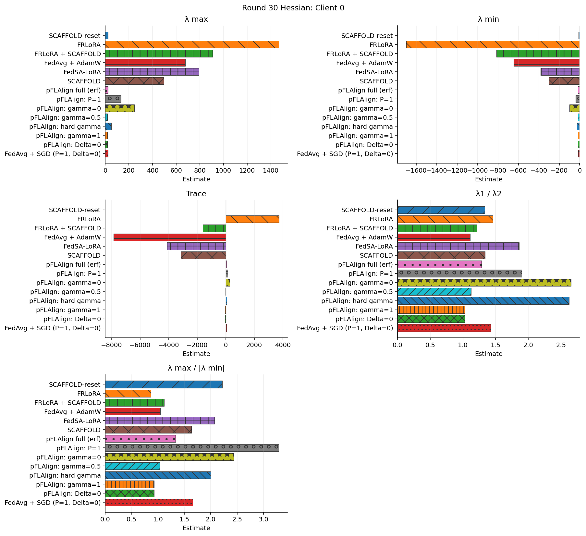
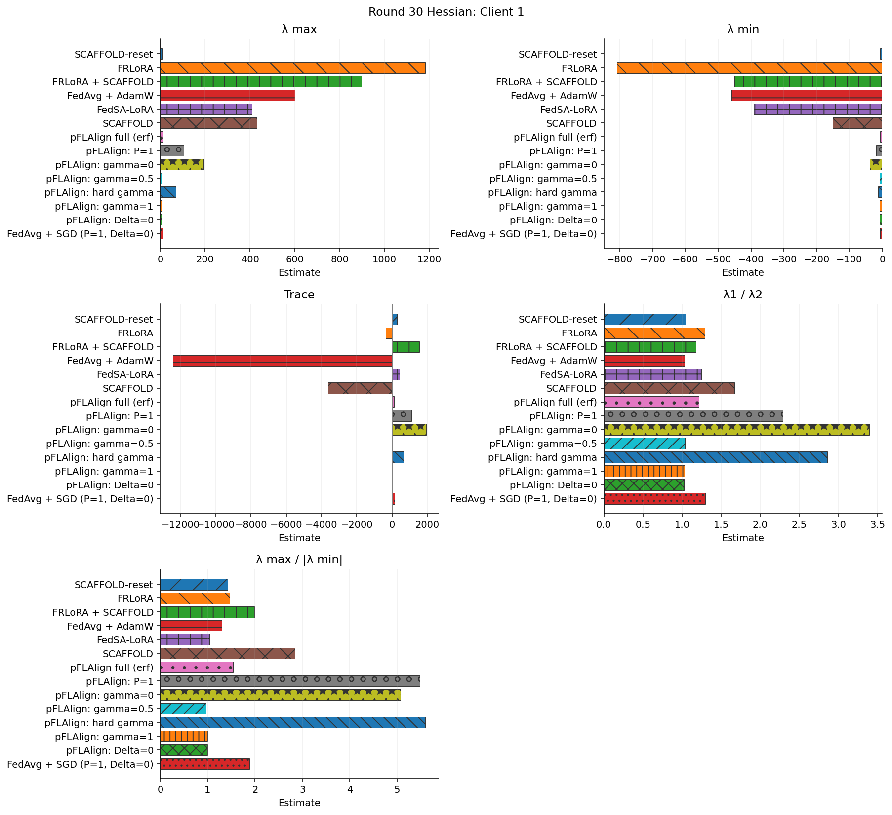
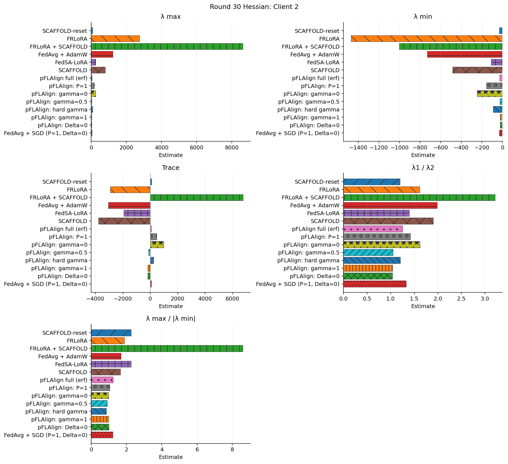
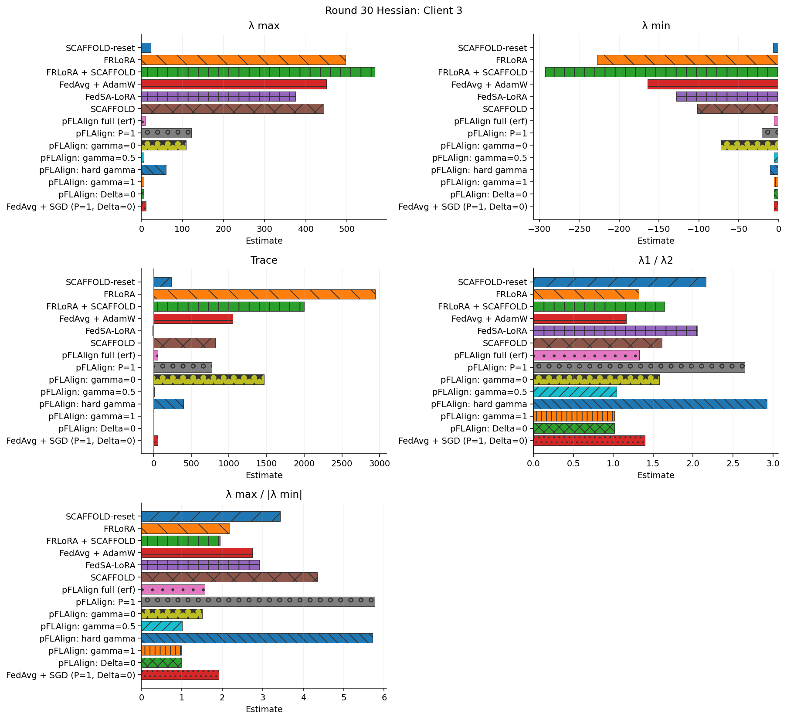
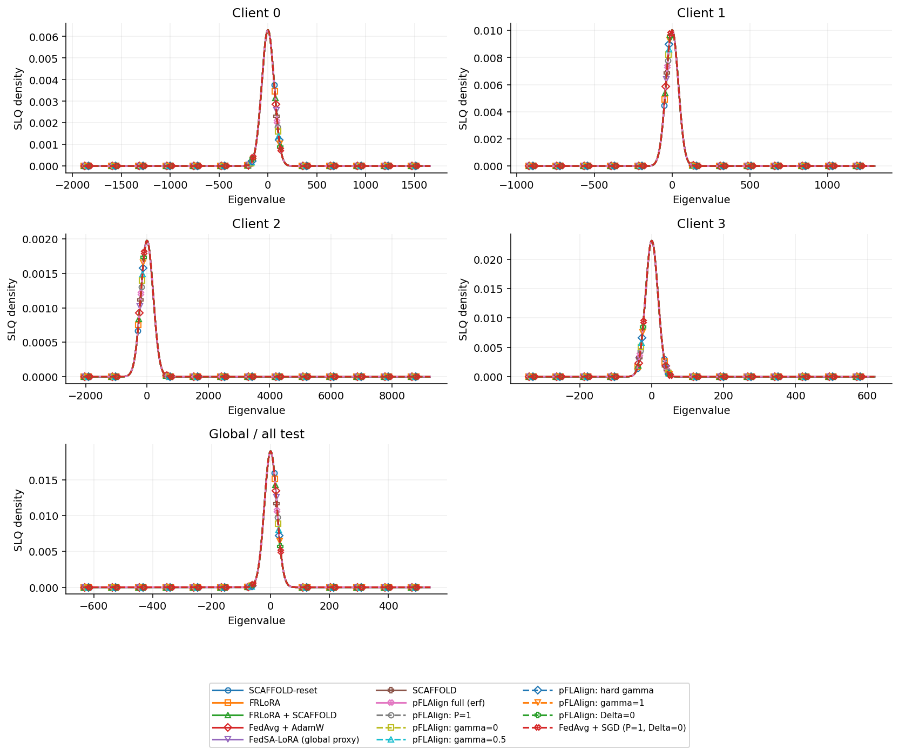

# 30라운드 Hessian 비교

[전체 성능 비교로 돌아가기](comparison.md)

LoRA A/B에 대한 completion-token 평균 NLL의 Hessian 추정값입니다. 로컬은 학습 직후 자기 태스크 test, 글로벌은 집계 후 전체 test에서 측정했습니다.

Lanczos 20 steps × 2 probes, Hutchinson trace 4 probes. 최대·최소·두 번째 고유값은 Ritz 추정값이며, λ1/λ2는 대수적으로 가장 큰 두 고유값의 비율입니다. λ max / |λ min|는 최대 고유값을 최소 고유값의 절댓값으로 나눈 값입니다. 최소 고유값이 0이면 정의되지 않아 —로 표시하며, 0에 가까우면 비율이 민감해집니다. Trace SE는 trace 추정의 표준오차입니다. 숫자가 작다고 자동으로 성능이 좋다는 뜻은 아닙니다.

학습 전 baseline은 Hessian을 측정하지 않아 아래 비교에서 제외했습니다. FedSA의 글로벌 행은 공유 A + 가중 평균 B proxy입니다.

## 글로벌 · 전체 test

| 방법 | λ max | λ min | Trace | λ1 / λ2 | λ max / |λ min| | λ2 | Trace SE |
|---|---:|---:|---:|---:|---:|---:|---:|
| SCAFFOLD-reset | 4.31775 | -3.55215 | 44.3489 | 1.2127 | 1.21553 | 3.56046 | 29.2898 |
| FRLoRA | 477.859 | -572.575 | -1223.04 | 1.2326 | 0.834579 | 387.683 | 532.559 |
| FRLoRA + SCAFFOLD | 473.884 | -375.448 | 1366.75 | 1.20174 | 1.26219 | 394.332 | 1795.58 |
| FedAvg + AdamW | 363.542 | -101.602 | -2462.56 | 1.7378 | 3.5781 | 209.197 | 1168.21 |
| FedSA-LoRA (global proxy) | 277.62 | -50.4559 | -1533.54 | 3.64137 | 5.50223 | 76.2405 | 458.934 |
| SCAFFOLD | 261.848 | -86.2396 | -1377.77 | 1.75319 | 3.03629 | 149.355 | 648.977 |
| pFLAlign full (erf) | 9.62161 | -5.83311 | 83.4172 | 1.3907 | 1.64948 | 6.91854 | 8.49122 |
| pFLAlign: P=1 | 86.4712 | -11.6385 | 779.605 | 2.65862 | 7.42975 | 32.5248 | 72.7563 |
| pFLAlign: gamma=0 | 123.873 | -31.5185 | 1477.15 | 2.71264 | 3.93018 | 45.6652 | 63.4592 |
| pFLAlign: gamma=0.5 | 6.44393 | -6.86352 | 7.38204 | 1.03208 | 0.938867 | 6.24363 | 7.23688 |
| pFLAlign: hard gamma | 49.7455 | -7.64545 | 422.283 | 3.33998 | 6.50655 | 14.8939 | 62.661 |
| pFLAlign: gamma=1 | 6.32361 | -6.71002 | -9.84992 | 1.01522 | 0.942414 | 6.22878 | 7.01139 |
| pFLAlign: Delta=0 | 6.31747 | -6.69804 | -9.85911 | 1.01477 | 0.943181 | 6.22552 | 6.91337 |
| FedAvg + SGD (P=1, Delta=0) | 11.0021 | -4.91913 | 90.9828 | 1.60195 | 2.2366 | 6.86795 | 11.125 |

## Client 0 · closed_qa

| 방법 | λ max | λ min | Trace | λ1 / λ2 | λ max / |λ min| | λ2 | Trace SE |
|---|---:|---:|---:|---:|---:|---:|---:|
| SCAFFOLD-reset | 23.892 | -10.7636 | 8.50487 | 1.33533 | 2.21969 | 17.8922 | 131.001 |
| FRLoRA | 1467.63 | -1699.21 | 3744.42 | 1.45602 | 0.863716 | 1007.98 | 4415.8 |
| FRLoRA + SCAFFOLD | 908.416 | -813.865 | -1606.16 | 1.21036 | 1.11618 | 750.531 | 2770.63 |
| FedAvg + AdamW | 676.323 | -647.441 | -7851.92 | 1.11034 | 1.04461 | 609.112 | 1621.67 |
| FedSA-LoRA | 792.256 | -382.064 | -4111.45 | 1.86145 | 2.07362 | 425.613 | 2943.52 |
| SCAFFOLD | 496.794 | -304.415 | -3121.02 | 1.33939 | 1.63196 | 370.911 | 839.844 |
| pFLAlign full (erf) | 22.0652 | -16.5843 | 53.6179 | 1.28298 | 1.33049 | 17.1984 | 103.027 |
| pFLAlign: P=1 | 131.887 | -40.0794 | 141.551 | 1.89752 | 3.29064 | 69.505 | 114.527 |
| pFLAlign: gamma=0 | 245.091 | -100.792 | 279.382 | 2.65212 | 2.43166 | 92.4135 | 147.753 |
| pFLAlign: gamma=0.5 | 18.5565 | -17.9514 | -9.84232 | 1.12708 | 1.03371 | 16.4642 | 133.328 |
| pFLAlign: hard gamma | 51.2083 | -25.5848 | 82.1466 | 2.6256 | 2.00151 | 19.5035 | 63.9872 |
| pFLAlign: gamma=1 | 17.1702 | -18.4985 | -35.5301 | 1.03095 | 0.928193 | 16.6548 | 136.517 |
| pFLAlign: Delta=0 | 17.1432 | -18.4641 | -34.9113 | 1.03 | 0.928458 | 16.6438 | 136.408 |
| FedAvg + SGD (P=1, Delta=0) | 23.3945 | -14.1253 | 57.961 | 1.42136 | 1.65621 | 16.4592 | 93.8021 |

## Client 1 · information_extraction

| 방법 | λ max | λ min | Trace | λ1 / λ2 | λ max / |λ min| | λ2 | Trace SE |
|---|---:|---:|---:|---:|---:|---:|---:|
| SCAFFOLD-reset | 10.0339 | -7.07164 | 287.307 | 1.04716 | 1.4189 | 9.58205 | 59.0198 |
| FRLoRA | 1181.94 | -808.192 | -349.507 | 1.28758 | 1.46245 | 917.953 | 4761.03 |
| FRLoRA + SCAFFOLD | 896.838 | -450.401 | 1542.87 | 1.17755 | 1.9912 | 761.611 | 2640.47 |
| FedAvg + AdamW | 599.126 | -460.135 | -12437.5 | 1.03133 | 1.30207 | 580.923 | 3145.51 |
| FedSA-LoRA | 407.63 | -391.929 | 422.6 | 1.24952 | 1.04006 | 326.229 | 741.941 |
| SCAFFOLD | 429.826 | -151.263 | -3623.77 | 1.6721 | 2.84158 | 257.058 | 1325.68 |
| pFLAlign full (erf) | 11.4149 | -7.44473 | 127.685 | 1.21174 | 1.53328 | 9.42025 | 81.6615 |
| pFLAlign: P=1 | 104.108 | -19.0122 | 1095.62 | 2.29131 | 5.47584 | 45.4359 | 214.663 |
| pFLAlign: gamma=0 | 193.295 | -38.1239 | 1933.91 | 3.39116 | 5.07019 | 56.9998 | 292.59 |
| pFLAlign: gamma=0.5 | 7.91774 | -8.18807 | 43.08 | 1.03958 | 0.966985 | 7.61631 | 76.3334 |
| pFLAlign: hard gamma | 68.6748 | -12.2659 | 640.079 | 2.85579 | 5.59886 | 24.0476 | 168.243 |
| pFLAlign: gamma=1 | 7.72016 | -7.78284 | 31.169 | 1.02891 | 0.991947 | 7.50327 | 75.6732 |
| pFLAlign: Delta=0 | 7.71417 | -7.77421 | 31.0974 | 1.02836 | 0.992277 | 7.50143 | 75.6361 |
| FedAvg + SGD (P=1, Delta=0) | 13.1249 | -6.99027 | 147.009 | 1.2974 | 1.87759 | 10.1163 | 84.626 |

## Client 2 · classification

| 방법 | λ max | λ min | Trace | λ1 / λ2 | λ max / |λ min| | λ2 | Trace SE |
|---|---:|---:|---:|---:|---:|---:|---:|
| SCAFFOLD-reset | 69.6125 | -30.7465 | 99.3417 | 1.2004 | 2.26408 | 57.9911 | 159.218 |
| FRLoRA | 2751.83 | -1470.74 | -2903.92 | 1.615 | 1.87105 | 1703.92 | 5247.77 |
| FRLoRA + SCAFFOLD | 8623.72 | -1003.6 | 6772.82 | 3.20945 | 8.59278 | 2686.98 | 2498.26 |
| FedAvg + AdamW | 1226.33 | -729.886 | -3047.12 | 1.98694 | 1.68017 | 617.195 | 1989.84 |
| FedSA-LoRA | 251.754 | -111.46 | -1919.53 | 1.39521 | 2.2587 | 180.442 | 342.421 |
| SCAFFOLD | 799.517 | -483.85 | -3770.87 | 1.89971 | 1.65241 | 420.863 | 2259.34 |
| pFLAlign full (erf) | 36.4368 | -29.5621 | 88.4914 | 1.24905 | 1.23255 | 29.1716 | 200.718 |
| pFLAlign: P=1 | 162.815 | -156.18 | 466.878 | 1.41626 | 1.04249 | 114.962 | 561.192 |
| pFLAlign: gamma=0 | 241.287 | -247.839 | 986.203 | 1.62244 | 0.973563 | 148.718 | 351.226 |
| pFLAlign: gamma=0.5 | 23.9124 | -26.5827 | -117.107 | 1.04902 | 0.899548 | 22.795 | 170.84 |
| pFLAlign: hard gamma | 77.6189 | -90.9733 | 254.406 | 1.20498 | 0.853205 | 64.4151 | 336.58 |
| pFLAlign: gamma=1 | 23.3103 | -23.5729 | -193.275 | 1.03776 | 0.98886 | 22.462 | 153.768 |
| pFLAlign: Delta=0 | 23.2872 | -23.5342 | -193.641 | 1.03708 | 0.989502 | 22.4546 | 153.335 |
| FedAvg + SGD (P=1, Delta=0) | 38.4352 | -31.5286 | 87.2512 | 1.32757 | 1.21906 | 28.9516 | 196.915 |

## Client 3 · summarization

| 방법 | λ max | λ min | Trace | λ1 / λ2 | λ max / |λ min| | λ2 | Trace SE |
|---|---:|---:|---:|---:|---:|---:|---:|
| SCAFFOLD-reset | 23.3018 | -6.78334 | 236.924 | 2.16347 | 3.43515 | 10.7705 | 22.7902 |
| FRLoRA | 496.665 | -227.685 | 2943.34 | 1.31948 | 2.18137 | 376.409 | 983.788 |
| FRLoRA + SCAFFOLD | 568.016 | -292.832 | 1996.35 | 1.64193 | 1.93973 | 345.944 | 1307.52 |
| FedAvg + AdamW | 450.359 | -164.114 | 1048.78 | 1.16243 | 2.74418 | 387.427 | 843.11 |
| FedSA-LoRA | 374.674 | -128.081 | -13.891 | 2.05944 | 2.92529 | 181.93 | 609.279 |
| SCAFFOLD | 443.927 | -102.045 | 818.479 | 1.60716 | 4.35028 | 276.218 | 746.625 |
| pFLAlign full (erf) | 9.34714 | -5.95962 | 53.0097 | 1.32775 | 1.56841 | 7.03984 | 45.8359 |
| pFLAlign: P=1 | 121.793 | -21.1114 | 769.805 | 2.64942 | 5.76906 | 45.9696 | 134.374 |
| pFLAlign: gamma=0 | 108.792 | -72.4714 | 1469.38 | 1.57445 | 1.50118 | 69.0985 | 120.686 |
| pFLAlign: gamma=0.5 | 5.54071 | -5.50526 | 9.63701 | 1.04036 | 1.00644 | 5.32577 | 38.738 |
| pFLAlign: hard gamma | 59.7099 | -10.4549 | 396.816 | 2.92384 | 5.71117 | 20.4217 | 107.022 |
| pFLAlign: gamma=1 | 5.42381 | -5.50613 | 1.49603 | 1.01689 | 0.985049 | 5.33375 | 38.2279 |
| pFLAlign: Delta=0 | 5.42088 | -5.50208 | 1.37457 | 1.01652 | 0.985243 | 5.33279 | 38.284 |
| FedAvg + SGD (P=1, Delta=0) | 11.1373 | -5.81633 | 56.3622 | 1.39746 | 1.91483 | 7.96964 | 50.9437 |

## Spectrum density

방법 간 동일한 smoothing bandwidth를 사용한 SLQ 밀도 추정입니다.

